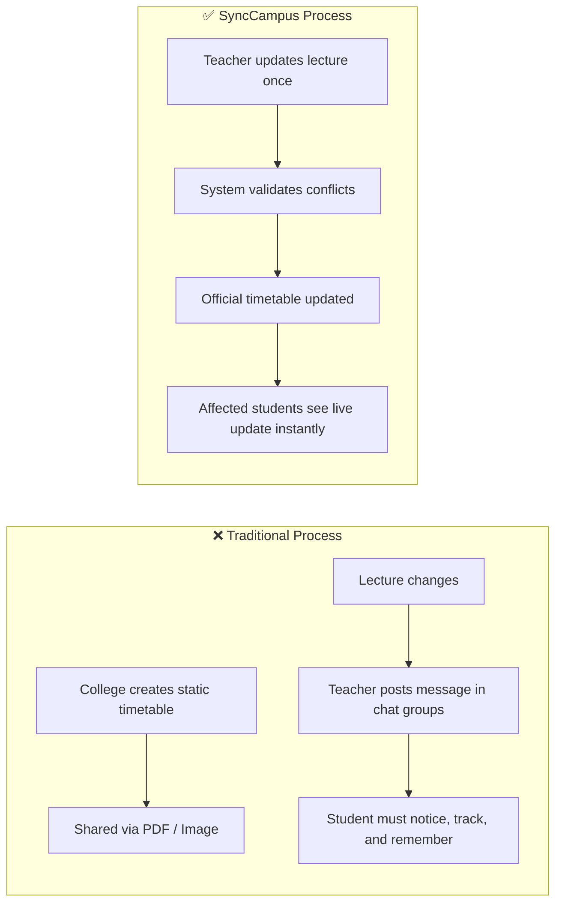
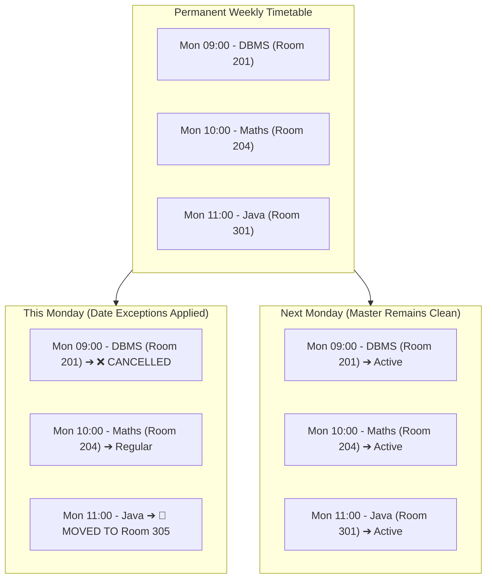
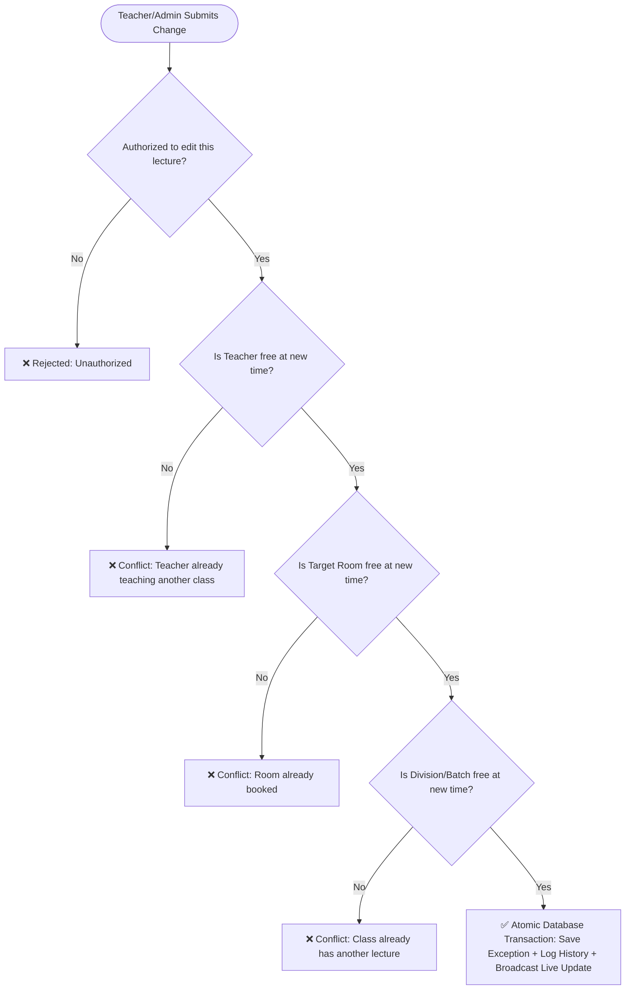
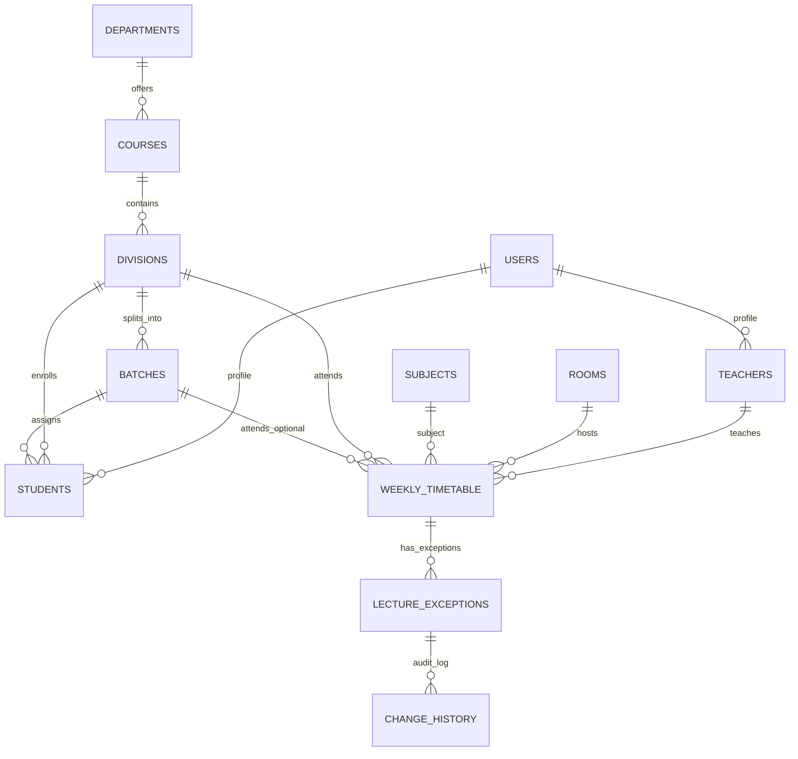
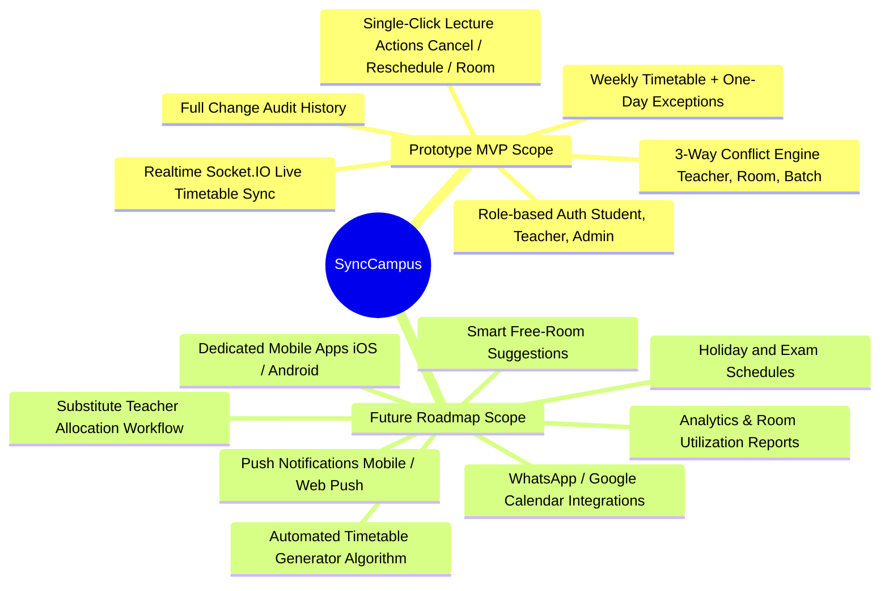

# SyncCampus: Dynamic Academic Timetable and Lecture Communication System

> **Core Philosophy:** *"Change the timetable once, and everyone affected sees the correct update."*  
> The timetable is the single source of truth. A change is not just announced; the timetable itself is updated live.

---

## 1. Executive Summary & Introduction

College timetables are traditionally static schedules planned once at the beginning of an academic semester. However, real daily academic operations are dynamic:
- Lectures are cancelled due to unforeseen circumstances.
- Lecture timings are rescheduled.
- Rooms/laboratories are swapped or changed.

### The Real Problem
The problem is not a lack of communication, but **disconnection**:
- Schedule information lives in two conflicting places: the **official timetable** and **informal messaging channels** (WhatsApp, Telegram, SMS, notice boards).
- Students and teachers have to manually cross-reference and reconcile changes in their heads.
- Students end up traveling to wrong classrooms, attending cancelled lectures, or missing rescheduled slots.

### The Solution: SyncCampus
**SyncCampus** is a lightweight, web-based dynamic timetable and communication system that ensures:
1. **Direct Modification:** Teachers modify their own lectures directly on their schedule.
2. **Automated Conflict Checking:** The system enforces strict validation (teacher, room, and class availability) to prevent double bookings before persisting changes.
3. **Weekly Base + One-Day Exceptions Model:** Permanent master timetables remain undisturbed; day-to-day adjustments are stored as discrete date exceptions and reset automatically next week.
4. **Real-time Synchronization:** Changes are pushed immediately to all affected students and teachers without requiring page refreshes.



---

## 2. Stakeholders & Problem Matrix

| User Group | Problems Faced Today | SyncCampus Solution |
| :--- | :--- | :--- |
| **Students** | • Follow outdated PDFs/images.<br>• Miss last-minute cancellations/room changes.<br>• Travel to campus early or reach wrong classrooms.<br>• Cannot plan free study/travel time effectively. | • Real-time, read-only daily/weekly view.<br>• Visual badges for cancelled, rescheduled, or relocated lectures.<br>• Only accurate, relevant information shown. |
| **Teachers** | • Teach multiple classes/divisions/batches.<br>• Must remember to post separate messages in every group.<br>• Repeated queries from confused students. | • Single personal schedule view.<br>• 1-click lecture actions (Cancel, Reschedule, Change Room).<br>• Instant conflict validation. |
| **Admin / HOD** | • Timetable, rooms, and staff managed across disjointed sheets.<br>• No audit log of who changed what and when.<br>• Difficulty resolving classroom allocation clashes. | • Central master timetable management.<br>• Automated clash detection during assignments.<br>• Complete change history and audit trail. |

---

## 3. Comparison with Existing Alternatives

| Approach / Solution | Timetable Updates Itself? | Teacher Edits Own Lecture? | Automated Clash Check? | Only Affected Class Informed? | Lightweight Adoption? |
| :--- | :---: | :---: | :---: | :---: | :---: |
| **Notice Boards / PDF / Excel** | ❌ No | ❌ No | ❌ No | ❌ No | 🟢 Yes |
| **WhatsApp / Messaging Groups** | ❌ No | ❌ No | ❌ No | 🟡 Partly | 🟢 Yes |
| **Email / SMS Bulk Alerts** | ❌ No | ❌ No | ❌ No | 🟡 Partly | 🟢 Yes |
| **Heavy Enterprise ERPs** | 🟢 Yes | 🟡 Partly | 🟡 Partly | 🟢 Yes | ❌ No (Heavy, complex rollout) |
| **SyncCampus (Proposed)** | 🟢 **Yes** | 🟢 **Yes** | 🟢 **Yes** | 🟢 **Yes** | 🟢 **Yes** |

---

## 4. Core Architecture & Mechanisms

### 4.1 Weekly Timetable + One-Day Exceptions Model
The underlying principle preserves the integrity of academic planning:
- **Weekly Timetable (Master):** Defines the repeating weekly schedule structure.
- **Lecture Exceptions (Overrides):** Any cancellation, time shift, or room change creates an entry for **that specific date only**.
- When rendering a student's or teacher's view for a given date, the system merges the base weekly timetable with any active exceptions for that date. The following week automatically returns to normal without manual cleanup.



---

### 4.2 Role-Based Access Control (RBAC)

| Role | Permissions & Capabilities | Restrictions |
| :--- | :--- | :--- |
| **Student** | • View personal daily & weekly timetable.<br>• See live changes (Cancelled, Rescheduled, Room Swap). | Cannot edit or modify any timetable entries. |
| **Teacher** | • View personal timetable of assigned subjects/classes.<br>• Modify own lectures (Cancel, Reschedule, Change Room). | Cannot modify another teacher's lectures. |
| **Admin / HOD**| • Create and manage base master timetables.<br>• Manage departments, courses, teachers, rooms, classes.<br>• View all change logs. | Cannot save changes that create unresolved clashes. |

---

### 4.3 Conflict Detection Engine (Validation Logic)

Before any rescheduling or room adjustment is committed, the backend verifies three mandatory conditions:



#### Race Condition & Concurrency Handling
When two teachers attempt to book the same room for the same time slot concurrently:
- Validation is handled at the **database transaction level** (with appropriate locks/isolation constraints).
- The first transaction to commit secures the room.
- The colliding request fails gracefully with an explicit message (*"Room was just booked by Professor X; please select another room or time"*).

---

## 5. System Design & Technical Stack

### 5.1 Academic Organizational Hierarchy
SyncCampus models college structures to ensure granular targeting down to division or practical batch levels:

$$\text{College} \longrightarrow \text{Department} \longrightarrow \text{Course} \longrightarrow \text{Year} \longrightarrow \text{Division} \longrightarrow \text{Batch (Optional)}$$

- **Theory Lectures:** Linked to the entire **Division** (all enrolled students receive the update).
- **Practical Sessions / Labs:** Linked to a specific **Batch** (e.g., Batch B1) — changes to practicals notify only that sub-group without disturbing the rest of the class.

---

### 5.2 Three-Tier Architecture

```mermaid
graph TD
    Client["Client Tier: Frontend (React + TypeScript + Vite)
    - Role-based Timetable Views
    - Action Modals (Cancel, Reschedule, Room Swap)
    - Socket.IO Client for Live UI Updates"]

    Server["Application Tier: Backend (Node.js + Express + TypeScript)
    - JWT Auth & RBAC Middleware
    - Timetable Scheduling & Exception Merge Engine
    - 3-Way Conflict Validation Module
    - Socket.IO Realtime Broadcast Server"]

    DB[(Data Tier: PostgreSQL Database
    - Relational Integrity & Strict Constraints
    - ACID Transactions for Race Prevention
    - Exception & Audit Change History)]

    Client <-->|REST API (CRUD Actions)| Server
    Client <-->|WebSocket (Live Push Updates)| Server
    Server <-->|SQL Queries & Transactions| DB
```

### 5.3 Technology Stack

| Layer | Technology | Key Motivation |
| :--- | :--- | :--- |
| **Frontend** | React, TypeScript, Vite | Fast, responsive Single Page Application with dynamic role-based rendering. |
| **Backend** | Node.js, Express, TypeScript | High-performance asynchronous API layer with end-to-end type safety. |
| **Database** | PostgreSQL | Strong relational integrity, ACID transactions, and robust constraint checking. |
| **Realtime** | WebSocket (Socket.IO) | Instant push updates to active client sessions without manual browser refreshing. |
| **Authentication** | JWT + bcrypt | Secure stateless sessions with role verification on every API route. |

---

### 5.4 Database Schema / Data Model



#### Key Tables & Fields
1. **`users`**: `id`, `name`, `email`, `password_hash`, `role` (`student`, `teacher`, `admin`, `hod`), `created_at`
2. **`departments` / `courses` / `divisions` / `batches`**: Academic hierarchy metadata and links.
3. **`teachers` & `students`**: User profile references mapped to departments, divisions, or batches.
4. **`subjects` & `rooms`**: Subject name/code, room number, room type (classroom/lab), capacity.
5. **`weekly_timetable`**: `id`, `subject_id`, `teacher_id`, `division_id`, `batch_id` (nullable), `room_id`, `weekday` (0–6), `start_time`, `end_time`.
6. **`lecture_exceptions`**: `id`, `weekly_timetable_id`, `exception_date`, `status` (`cancelled`, `rescheduled`, `room_changed`), `new_start_time`, `new_end_time`, `new_room_id`, `changed_by_user_id`, `reason`.
7. **`change_history`**: `id`, `exception_id`, `changed_by`, `old_value`, `new_value`, `timestamp`.

---

## 6. Scope & Implementation Strategy

### 6.1 Prototype Scope vs Future Roadmap



---

## 7. Phased Development & Test Plan

```mermaid
gantt
    title SyncCampus Prototype Roadmap
    dateFormat  X
    axisFormat  Phase %d
    section Development
    Phase 1: DB Schema, Migrations & JWT Auth RBAC       :0, 1
    Phase 2: Master Weekly Timetable Creation & Views    :1, 2
    Phase 3: Exception Handling Engine (Cancel/Reschedule):2, 3
    Phase 4: Conflict Detection Logic & DB Constraints   :3, 4
    Phase 5: WebSocket Live Sync Integration             :4, 5
    Phase 6: Integration Testing & Edge Case Scenarios   :5, 6
```



### Planned Test Verification Scenarios:
1. **One-Day Exception Test:** A teacher cancels a Monday lecture $\rightarrow$ only that Monday reflects cancellation; next Monday remains active.
2. **Permission Boundary Test:** Teacher A attempts to modify Teacher B's lecture $\rightarrow$ Request rejected with 403 Forbidden.
3. **Student Read-Only Test:** Student account attempts API mutation $\rightarrow$ Request rejected.
4. **Teacher Clash Test:** Teacher attempts to reschedule a lecture to a slot where they already have a class $\rightarrow$ Rejected with descriptive conflict warning.
5. **Room Clash Test:** Teacher attempts to move a lecture to an occupied room $\rightarrow$ Rejected.
6. **Concurrency Race Test:** Two teachers simultaneously request the same free room $\rightarrow$ Exactly one succeeds; the second receives a clean rejection.
7. **Batch Isolation Test:** A practical lab session for Batch B1 is shifted $\rightarrow$ Only Batch B1's view updates; Batch B2 remains unaffected.

---

## 8. Summary Value Proposition

$$\text{SyncCampus} = \text{Lightweight Rollout} + \text{Live Source of Truth} + \text{Zero Schedule Drift}$$

SyncCampus eliminates the confusion of fragmented WhatsApp messages and outdated PDF notices by turning the timetable itself into a dynamic, reliable, self-updating hub for the entire institution.
